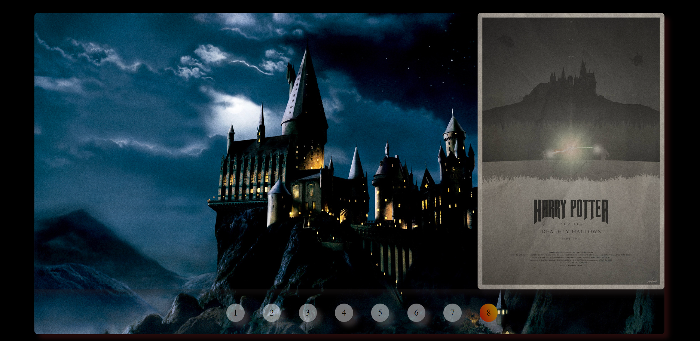

# Carrusel de Películas de Harry Potter

Este proyecto es un carrusel de películas de Harry Potter implementado utilizando HTML, CSS y JavaScript. Permite navegar a través de diferentes imágenes de las películas de la saga de Harry Potter.

## Capturas de Pantalla

> Las imagenes están en orden que coincide la pelicula con el numero de abajo del carrusel.

> Así mismo van moviendose a lo largo del background.

## Tecnologías Utilizadas

- HTML
- CSS
- JavaScript

## Funcionalidades

- Muestra una serie de imágenes representando las películas de Harry Potter.
- Permite navegar a través de las imágenes con controles por número.

## Cómo Usar

1. Clona este repositorio.
2. Abre el archivo `index.html` en tu navegador web.

## Personalización

Puedes personalizar este carrusel cambiando las imágenes en la carpeta `images/` y ajustando los estilos en el archivo `styles.css`.

## Contribuciones

Si quieres contribuir a este proyecto, ¡estoy abierta a sugerencias y mejoras! Siéntete libre de abrir un problema o enviar un pull request.

## Licencia

Este proyecto está bajo la Licencia [MIT](LICENSE).
